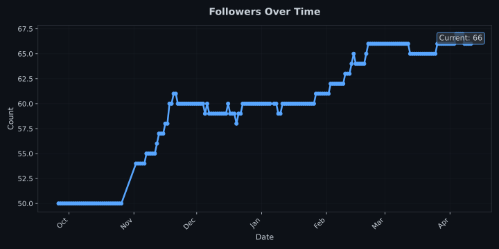
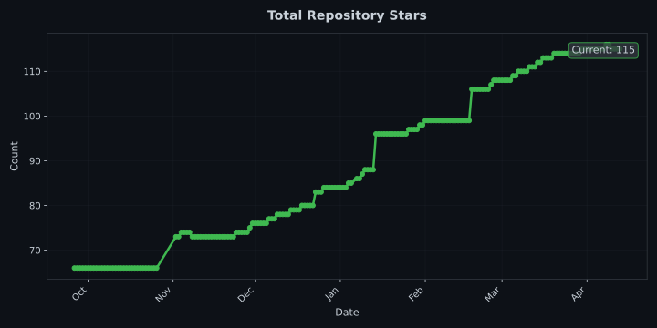

### About Me 

I became frustrated enough by the original Detectron2 docs that I decided to start creating my own https://georgepearse.github.io/unofficial-detectron2-docs/.

I write about Machine Learning, Analytics and Start-Ups at https://medium.com/@george.pearse

&nbsp;

I studied Physics, then I became a Data Engineering Consultant (Flask + SQL + AWS for orchestration), then I joined a Computer Vision start-up (behold.ai) where I've done a mixed bunch. Set-up the Modern Data Stack but also focused on data-centric-ai via active learning (pytorch-lightning and BAAL) and corrupt sample discovery (cleanlab esk techniques). I've also recently become much more involved in the MLOps community.

Soon to be joining BinIt as Lead ML Engineer. https://binit.ai/

### GitHub Metrics

  

  

I'm currently working on:
* Streamlit app for business intelligence (save SQL for transformations, plotly code for plotting).
* Quickdraw app via Streamlit (to try out some computer vision ideas).
* Active Learning via bagged ensemble disagreement. 
* Lightweight UIs for the QDrant Vector Database (and all things QDrant because they build excellent tools) https://github.com/GeorgePearse/QDrant-NLP
* Multi-modal ML tools.

### Blogs posts
<!-- BLOG-POST-LIST:START -->
- [The Missing Terminology of Data Centric AI](https://medium.com/@george.pearse/the-missing-terminology-of-data-centric-ai-5a0afb488817?source=rss-b502c2f08a7c------2)
- [How to train a model with MMDetection](https://medium.com/@george.pearse/how-to-train-a-model-with-mmdetection-8ab6a6fea3f0?source=rss-b502c2f08a7c------2)
- [Data Engine Design](https://medium.com/@george.pearse/data-engine-design-9b29a20ff9f0?source=rss-b502c2f08a7c------2)
- [Quick NLP Labelling with Bulk](https://medium.com/@george.pearse/quick-nlp-labelling-with-bulk-327ccb62320?source=rss-b502c2f08a7c------2)
- [Vector Databases for Data-Centric AI &lpar;Part 2&rpar;](https://medium.com/@george.pearse/vector-databases-for-data-centric-ai-part-2-ba995053ce05?source=rss-b502c2f08a7c------2)
<!-- BLOG-POST-LIST:END -->

<h3 align="left">Connect with me:</h3>

[![George%20Pearse Badge](https://img.shields.io/badge/George%20Pearse-6D04FF.svg?logo=data:image/svg+xml;base64,PD94bWwgdmVyc2lvbj0iMS4wIiBlbmNvZGluZz0idXRmLTgiPz4KPHN2ZyB2ZXJzaW9uPSIxLjEiIGlkPSJMYXllcl8xIiB4bWxucz0iaHR0cDovL3d3dy53My5vcmcvMjAwMC9zdmciIHhtbG5zOnhsaW5rPSJodHRwOi8vd3d3LnczLm9yZy8xOTk5L3hsaW5rIiB4PSIwcHgiIHk9IjBweCIKCSB2aWV3Qm94PSIwIDAgNTIwLjcgNDcyLjciIHN0eWxlPSJlbmFibGUtYmFja2dyb3VuZDpuZXcgMCAwIDUyMC43IDQ3Mi43OyIgeG1sOnNwYWNlPSJwcmVzZXJ2ZSI+CjxzdHlsZSB0eXBlPSJ0ZXh0L2NzcyI+Cgkuc3Qwe2ZpbGw6I0ZGNkQwMDt9Cgkuc3Qxe2ZpbGw6IzlCOUI5Qjt9Cjwvc3R5bGU+CjxnIGlkPSJzdXJmYWNlMSI+Cgk8cGF0aCBjbGFzcz0ic3QwIiBkPSJNMTIwLjksNDMuMmMwLTIuMiwxLjMtMy41LDIuMi0zLjhjMC42LTAuMywxLjMtMC42LDIuMi0wLjZjMC42LDAsMS42LDAuMywyLjIsMC42bDEzLjcsOEwxNjcuNiwzMmwtMjYuOC0xNS4zCgkJYy05LjYtNS40LTIxLjEtNS40LTMxLDBjLTkuNiw1LjgtMTUuMywxNS43LTE1LjMsMjYuOHYyODYuM2wyNi4yLDE1LjN2LTMwMmgwLjJWNDMuMnoiLz4KCTxwYXRoIGNsYXNzPSJzdDAiIGQ9Ik0xMjcuOSw0MjkuNmMtMS45LDEtMy44LDAuNi00LjUsMGMtMS0wLjYtMi4yLTEuNi0yLjItMy44di0xNS43TDk1LDM5NC43djMxYzAsMTEuMiw1LjgsMjEuMSwxNS4zLDI2LjgKCQljNC44LDIuOSwxMC4yLDQuMiwxNS4zLDQuMmM1LjQsMCwxMC41LTEuMywxNS4zLTQuMkw0MDIsMzAxLjd2LTMwLjRMMTI3LjksNDI5LjZ6Ii8+Cgk8cGF0aCBjbGFzcz0ic3QwIiBkPSJNNDcyLjQsMjA3LjhsLTI0OC0xNDMuMmwtMjYuNSwxNUw0NTksMjMwLjVjMS45LDEuMywyLjIsMi45LDIuMiwzLjhzLTAuMywyLjktMi4yLDMuOGwtMTEuOCw2Ljd2MzAuNAoJCWwyNC45LTE0LjRjOS42LTUuNCwxNS4zLTE1LjcsMTUuMy0yNi44QzQ4Ny43LDIyMy4xLDQ4MiwyMTMuMiw0NzIuNCwyMDcuOHoiLz4KCTxwYXRoIGNsYXNzPSJzdDEiIGQ9Ik03OS43LDM2OC41bDIyLjcsMTMuMWwyNi4yLDE1LjNsNy43LDQuNWw1LjQsMy4ybDk1LjUtNTUuM3YtOTUuMmMwLTEyLjEsNi40LTIzLjMsMTYuOS0yOS40bDgyLjQtNDcuNgoJCUwxOTAuMiw5Mi44bC0yMi43LTEzLjFsMjIuNy0xMy4xbDI2LjItMTUuM2w3LjctNC41bDcuNyw0LjVsMTYxLDkzLjNsMy4yLTEuOWM5LjMtNS40LDIxLjEsMS4zLDIxLjEsMTIuMXYzLjhsMTUsOC42VjE0MgoJCWMwLTEyLjUtNi43LTI0LTE3LjMtMzBMMjU0LjUsMTkuM2MtMTAuOS02LjQtMjQtNi40LTM0LjgsMEwxMzYsNjcuNnYzMDMuMmwtMjIuNy0xMy4xTDg3LDM0Mi4zbC03LjMtNC4ydi0yMzhsLTIwLjEsMTEuNQoJCWMtMTAuOSw2LjEtMTcuMywxNy42LTE3LjMsMzB2MTg1YzAsMTIuNSw2LjcsMjQsMTcuMywzMEw3OS43LDM2OC41eiIvPgoJPHBhdGggY2xhc3M9InN0MSIgZD0iTTQxNy4xLDIyMy44djk0LjljMCwxMi4xLTYuNCwyMy4zLTE2LjksMjkuNGwtMTQxLjksODIuMWMtOS4zLDUuNC0yMS4xLTEuMy0yMS4xLTEyLjF2LTMuOEwxOTcuOSw0MzcKCQlsMjEuNywxMi41YzEwLjksNi40LDI0LDYuNCwzNC44LDBMNDE0LjYsMzU3YzEwLjktNi40LDE3LjMtMTcuNiwxNy4zLTMwdi05NC42TDQxNy4xLDIyMy44eiIvPgo8L2c+Cjwvc3ZnPg==&style=for-the-badge&label=contributor&labelColor=212529)](https://github.com/voxel51/fiftyone)

